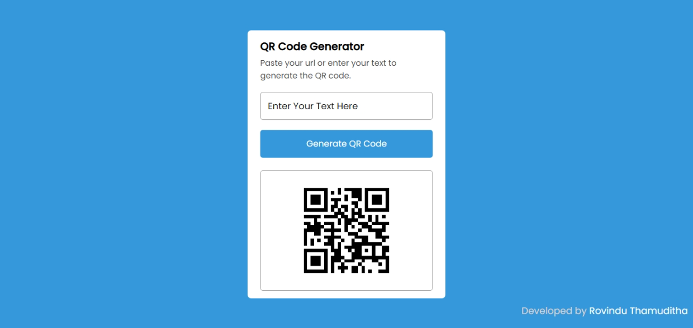

# QR CODE GEN Web App

Welcome to the QR CODE GEN Web App! This web application allows you to easily generate QR codes for various purposes. Whether you need a QR code for a website URL, contact information, or any other text-based data, this app has got you covered.

## Features

- **Quick QR Code Generation:** Generate QR codes instantly by simply entering the desired text or URL.
- **Download and Share:** Download the generated QR codes as high-resolution images and share them with others easily.
- **Responsive Design:** Enjoy a seamless experience across different devices, including desktops, tablets, and mobile phones.

## Getting Started

To use the QR CODE GEN Web App, follow these simple steps:

1. Visit the web application at [https://qr-code-gen-app.com](https://qr-code-gen-app.com).
2. Enter the text or URL for which you want to generate a QR code.
3. Optionally, customize the QR code's appearance by selecting your preferred color, size, and style.
4. Click the "Generate" button to create your QR code.
5. Once generated, you can download the QR code image by clicking the "Download" button.
6. Share the QR code with others by using the provided sharing options.

## API Integration

This web app integrates with the GoQR.me API to generate QR codes. Here's an example of how to make a request using JavaScript:

## Dependencies

The QR CODE GEN Web App utilizes the following dependencies:

- HTML - Markup language for creating web pages.
- CSS - Styling language for HTML documents.
- JavaScript - Programming language for web development.
- GoQR.me API - API for generating QR codes.
- SweetAlert - JavaScript library for beautiful and customizable alert dialogs.

## Development

If you want to run the QR CODE GEN Web App locally or contribute to its development, follow these steps:

1. Clone the repository: `git clone https://github.com/your-username/qr-code-gen-web-app.git`
2. Open the project directory in your preferred code editor.
3. Modify the HTML, CSS, and JavaScript files as needed.
4. Start a local development server to preview your changes.

## Feedback and Support

If you encounter any issues while using the QR CODE GEN Web App or have any suggestions for improvement, please submit an issue at [https://github.com/Rovindu-Thamuditha/qrgen/issues]. We appreciate your feedback and will do our best to address any problems promptly.

# License

This project is licensed under the [MIT License](LICENSE). Feel free to modify and use the code as per your needs.

---
Enjoy generating beautiful QR codes with ease using the QR CODE GEN Web App!
